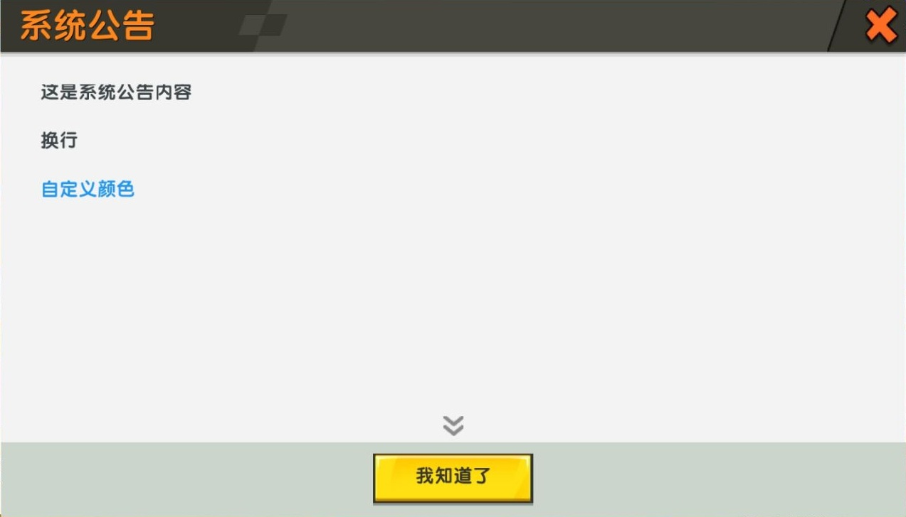

# `ns_start_notice`
<!-- 暂未完成 -->
## 变量
- `brief`:`{string}`  
滚动公告栏显示的信息，如图所示(内容被修改过)。  
  
点击左边按钮打开*系统公告*。  
- `txt`:`{string}`  
系统公告信息，如图所示(内容被修改过)。  
  
如果 `txt` 为空字符串 `""` ，则点击按钮打开系统公告不会生效，并会弹出悬浮窗显示 `暂无公告! !` 。  
